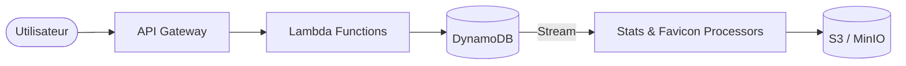

# TP Serverless URL Shortener

Un service de raccourcissement d'URL moderne, **Event-Driven** et entièrement **Serverless**. Conçu nativement pour l'écosystème AWS, ce projet offre une fidélité de production en environnement local grâce à Docker, SAM CLI et un moteur de simulation de streams intégré.

---

##  Architecture et Fonctionnement

Le projet repose sur une architecture découplée où chaque action déclenche des processus asynchrones pour garantir performance et scalabilité.

- **API REST** : Gérée par AWS Lambda via API Gateway (HTTP Api).
- **Stockage de Données** : DynamoDB assure la persistance des URLs et des événements de clic.
- **Traitement Asynchrone** : Utilisation de **DynamoDB Streams** pour déclencher automatiquement des tâches de fond :
    - Mise à jour des statistiques quotidiennes.
    - Récupération et stockage des favicons via S3/MinIO.
- **Infrastructure as Code (IaC)** : Définition complète via AWS SAM (`template.yaml`).

### Diagramme de flux (Mermaid)


---

## Stack Technique

| Composant | Technologie | Rôle |
|:--- |:--- |:--- |
| **Runtime** | Node.js 20.x | Logique métier des fonctions Lambda. |
| **Logic API** | AWS Lambda | Traitement des requêtes et processus asynchrones. |
| **Base de données** | Amazon DynamoDB | Tables `urls`, `click_events` et `daily_stats`. |
| **Stockage Assets** | S3 (AWS) / MinIO (Local) | Stockage permanent des favicons (`favicon.ico`). |
| **Conteneurisation** | Docker | Simulation de l'infrastructure Cloud en local. |
| **Orchestration** | AWS SAM | Déploiement et émulation de l'environnement Serverless. |

---

## Installation et Configuration Locale

### Prérequis

- **Docker & Docker Compose**
- **Node.js 20+**
- **AWS SAM CLI**
- **AWS CLI** (Configuré avec un profil local/fictif)

### Étapes de configuration

1. **Démarrer l'infrastructure simulée** :
   Démarrez les conteneurs pour DynamoDB et MinIO :
   ```bash
   docker compose up -d
   ```

2. **Initialiser les ressources** :
   Préparez l'environnement local en créant les tables et les buckets nécessaires :
   ```bash
   node src/lib/setup-s3.js       # Configuration du bucket Favicons
   node src/lib/setup-dynamodb.js # Création des tables DynamoDB
   ```

3. **Lancer l'API (SAM Local)** :
   Exécutez l'API dans le réseau Docker du projet :
   ```bash
   sam local start-api --docker-network url-shortener_net
   ```

---

## Documentation de l'API

### 1. Créer un raccourci
Génère une clé unique pour une URL longue donnée.
- **Endpoint** : `POST /shorten`
- **Body** :
  ```json
  { "url": "https://www.google.com" }
  ```
- **Réponse** :
  ```json
  {
      "shortKey": "WDnIeS",
      "shortUrl": "http://localhost:3000/WDnIeS",
      "longUrl": "https://www.google.com",
      "createdAt": 1770423123010
  }
  ```

### 2. Redirection
Redirige vers l'URL originale et enregistre un événement de clic.
- **Endpoint** : `GET /{shortKey}`
- **Exemple** : `http://127.0.0.1:3000/WDnIeS`

### 3. Statistiques
Récupère l'historique des clics agrégé par jour.
- **Endpoint** : `GET /stats/{shortKey}`
- **Exemple** : `http://127.0.0.1:3000/stats/WDnIeS`
- **Réponse** :
  ```json
  {
      "shortKey": "WDnIeS",
      "stats": [
          { "statDate": "2026-02-07", "totalClicks": 21 }
      ]
  }
  ```

### 4. Liste des URLs
Affiche toutes les URLs créées avec leurs métadonnées (clics, favicons).
- **Endpoint** : `GET /urls`
- **Réponse** :
  ```json
  [
      {
          "shortKey": "WDnIeS",
          "longUrl": "https://www.google.com",
          "totalClicks": 6,
          "favicon": "favicons/WDnIeS.ico"
      }
  ]
  ```

---

## Configuration (Variables d'Environnement)

| Variable | Description | Valeur par Défaut |
|:--- |:--- |:--- |
| `DYNAMODB_ENDPOINT` | Point d'accès à la base de données | `http://url-shortener-dynamodb:8000` |
| `TABLE_URLS` | Nom de la table des URLs | `urls` |
| `TABLE_CLICK_EVENTS` | Table des événements de clics | `click_events` |
| `TABLE_DAILY_STATS` | Table des agrégations de stats | `daily_stats` |
| `FAVICONS_BUCKET` | Nom du bucket S3 (Favicons) | *Auto-généré* |

---

## Structure du Projet

```text
.
├── src/
│   ├── handlers/      # Fonctions Lambda (shorten, redirect, stats...)
│   └── lib/           # Utilitaires et scripts d'initialisation
├── template.yaml      # Définition de l'infrastructure AWS SAM
├── docker-compose.yml # Services locaux (DynamoDB, MinIO)
└── samconfig.toml     # Configuration de déploiement SAM
```
